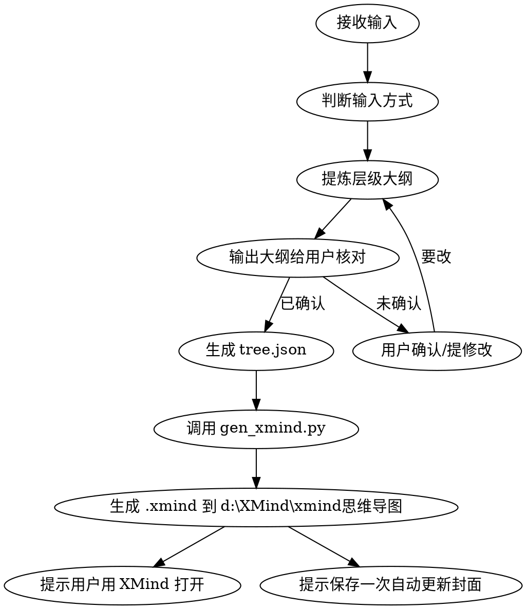

# XMind 思维导图生成器（v1.0）

把用户给出的内容提炼成结构化的思维导图，生成**新版 XMind 格式**的 `.xmind` 文件，用户可直接用 XMind 打开。

## Overview

**核心原则：**
- **两步走**：先生成文字版「大纲」给用户核对 → 用户确认内容无误后 → 才生成 `.xmind` 文件（避免内容没定就白做）。
- **纯 Python 内置**生成，不联网、不装库，兼容本机新版 XMind（实测验证）。
- 自动配色 + 一级分支自动带图标。

**路径约定：**
- `{WORKSPACE}` = 当前工作目录
- `{OUTPUT_DIR}` = `d:\XMind\xmind思维导图\`（导图成果直接存此处，与用户已有导图放在一起）
- `{SKILL_DIR}` = 本 skill 所在目录（即 `d:\cc\.claude\skills\xmind-mindmap`）
- `{SCRIPT}` = `{SKILL_DIR}\scripts\gen_xmind.py`（生成器脚本）

---

## 输入方式（支持 4 种）

| 方式 | 用户怎么说 / 给什么 | 你做什么 |
|------|--------------------|----------|
| 粘贴文字 | 用户直接贴一段文字/文章/笔记 | 提炼成导图 |
| 读取本地文件 | 用户给一个文件路径（Word/PDF/txt/md） | 读取文件内容再提炼 |
| 给主题生成 | 用户只给一个主题 | 你组织内容生成 |
| markdown 转换 | 用户给已导出的 md 大纲 | 直接转成导图（不改内容） |

---

## 标准流程



---

## 第一阶段：提炼大纲并核对

### 步骤 1：判断输入方式
根据用户给出的是「文字 / 文件路径 / 主题 / md」，确定输入方式。

### 步骤 2：提炼成层级大纲

把内容梳理成一个层级结构。**控制层级别太深（建议 2~3 层）**，分支数量适中（一级分支 3~6 个为宜，内容多可适当增多），叶子节点是具体要点，不要过度拆碎。

### 步骤 3：以文字形式输出大纲给用户核对

用 Markdown 列表呈现，例如：

```markdown
# 中心主题：工业AI入门

- 什么是工业AI
  - 定义
  - 与消费AI的区别
- 核心技术
  - 机器视觉
  - 预测性维护
  - 知识图谱
- 落地场景
  - 质检
  - 排产
```

**然后停下来问用户：**
```
这是提炼出的大纲，请确认：
- [ ] 内容没问题，生成导图
- [ ] 需要修改（请告诉我改哪里）：__________
```

**内容没确认前不要生成 `.xmind`。**

---

## 第二阶段：确认后生成 .xmind

### 步骤 4：生成 tree.json

把核对好的大纲转成一个 JSON 文件（供生成器读取），结构如下：

```json
{
  "title": "中心主题",
  "children": [
    {"title": "分支1", "children": [{"title": "叶子"}, {"title": "叶子"}]},
    {"title": "分支2", "children": [...]}
  ]
}
```

把该 JSON 写到临时文件，例如 `d:\cc\_tree.json`（**用完即删**）。

### 步骤 5：调用生成器

```bash
python "{SKILL_DIR}/scripts/gen_xmind.py" --root "中心主题" --tree "d:\cc\_tree.json" --out "d:\XMind\xmind思维导图\导图文件.xmind"
```

文件名用「中心主题名」即可，例如 `工业AI入门.xmind`。

**参数说明：**
- `--root`：中心主题名（必填）
- `--tree`：大纲 JSON 文件（必填）
- `--out`：输出 .xmind 路径（必填）
- `--no-icons`：不加一级分支自动图标（可选）

### 步骤 6：告知用户结果

```
✅ 已生成：{OUTPUT_DIR}\{文件名}.xmind
📌 用 XMind 打开即可查看。

💡 想要"最近"列表里显示真正的导图封面：打开这个文件后 Ctrl+S 保存一次，
   XMind 会_自动_生成真实缩略图（默认的浅灰点只是占位）。
```

---

## 技术原理（了解即可，供调试）

新版 XMind（2020+）的 `.xmind` = 一个 zip 压缩包，含 5 个文件：

| 文件 | 作用 | 关键点 |
|------|------|--------|
| `content.json` | 真正的导图数据 | sheet → rootTopic → children.attached，每节点有 id/title |
| `metadata.json` | 版本信息 | `creator=Vana`、`dataStructureVersion=3`、`layoutEngineVersion=5` |
| `manifest.json` | 文件清单 | **不能把 manifest.json 自己列进 file-entries**，要列缩略图 |
| `content.xml` | 旧版占位符 | XMind 读的是 JSON，这只是写给旧版的警告 |
| `Thumbnails/thumbnail.png` | 缩略图 | 占位图即可，保存后 XMind 覆盖成真图 |

**常见坑：**
- `manifest.json` 误把自己列进去 → XMind 报「文档损坏」
- 缺 `content.xml` 或缩略图 → 可能报损坏/缩略图黑屏
- 中文必须 `ensure_ascii=False` 写入，否则乱码

---

## 自检清单

生成 .xmind 后，确认：
- [ ] 用户能用 XMind 打开、无「损坏」提示
- [ ] 分支自动上了不同颜色
- [ ] 一级分支带 priority 图标
- [ ] 中文无乱码
